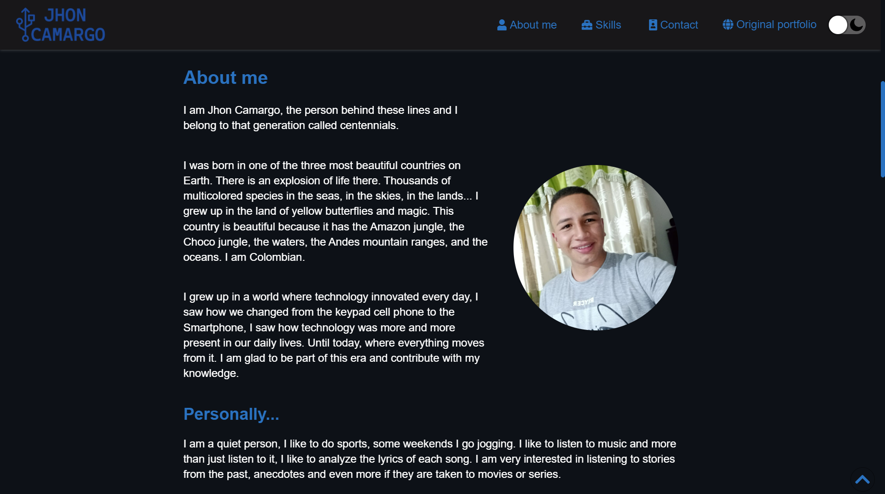
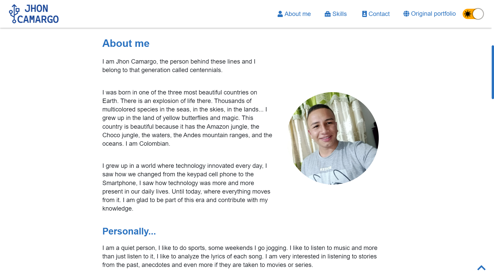

# Porfolio with node

This page is a NodeJS practice, the original portfolio is <a href="http://jhoncamargo.000webhostapp.com" target="_blanck">here</a>

## Preview




## How can I see it?

> Important, to view the portfolio you need to have NodeJS installed on your computer.

Follow the steps below...

1. Clone this repository on your computer

```git
git clone https://github.com/JhonCamargo07/porfolio-nodeJS.git
```

2. Open the project in a terminal (shell) and run the following

```shell
npm i
npm start
```

Ready, now visit the portfolio [http://127.0.0.1:64022/](http://127.0.0.1:64022/)

<a href="http://jhoncamargo.000webhostapp.com" target="_blanck">Original portfolio</a>

By: <a href="http://jhoncamargo.000webhostapp.com" target="_blanck">Jhon Camargo</a>
